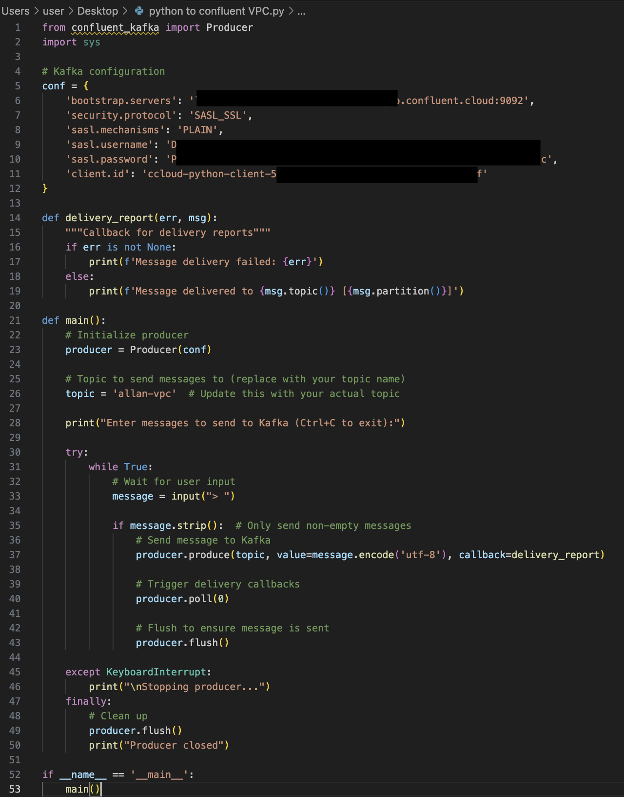

# VPC-peering-demo
AWS EC2 -> Confluent -> Atlas Stream Processing -> Atlas Cluster

# AWS setup:

# Confluent setup:

# Proxy setup to use the Confluent web UI on a VPC cluster:

# Atlas setup:

# Create a peering connection between Confluent and Atlas Stream Processing:

# Create and start the stream process worker:

# Run the python code in EC2:

# Verify that it all works:

